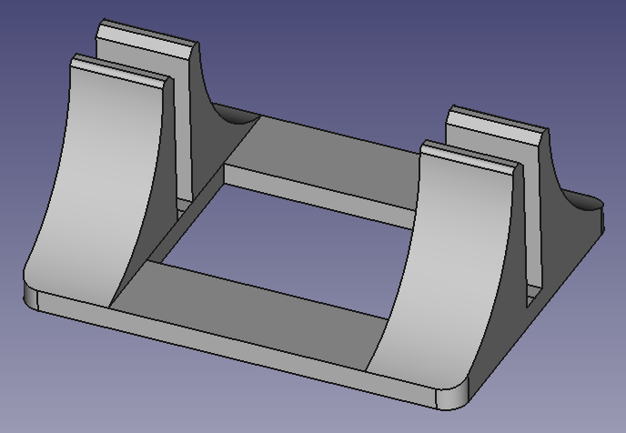

# Thinkpad Stand

Works with a thinkpad T15, T480, probably others.

Bounding box dimensions are 200mm x 150mm x 85mm

The vertical gap is designed to fit the trackpad.  The laptop sits at a depth that should not obstruct the keyboard.

# License
Thinkpad Stand © 2025 by Troy Denton is licensed under CC BY-NC-SA 4.0. To view a copy of this license, visit https://creativecommons.org/licenses/by-nc-sa/4.0/
